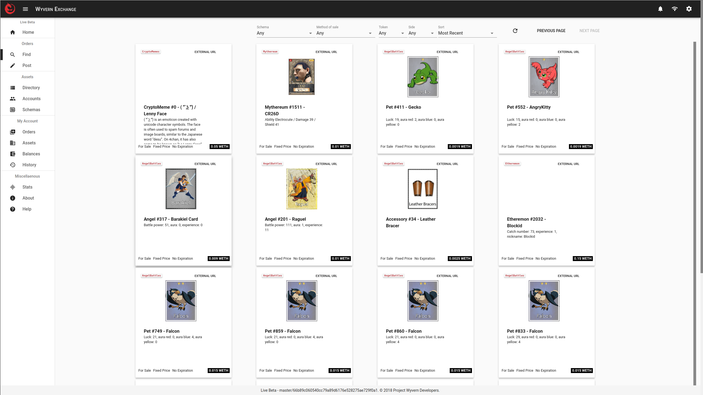
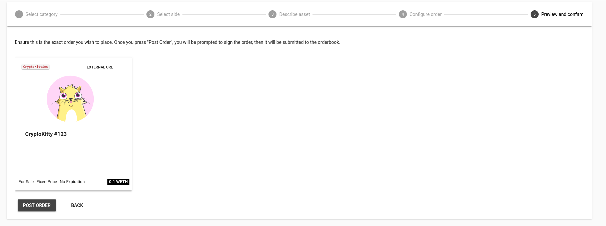
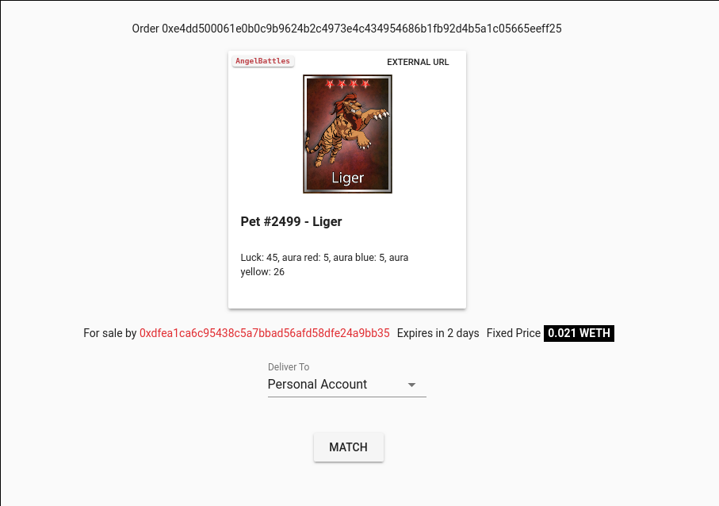
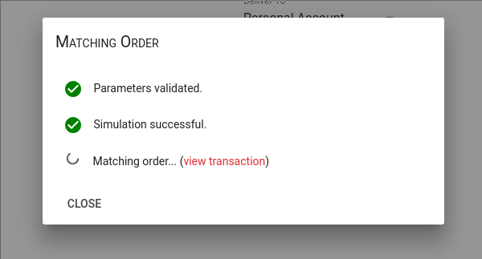
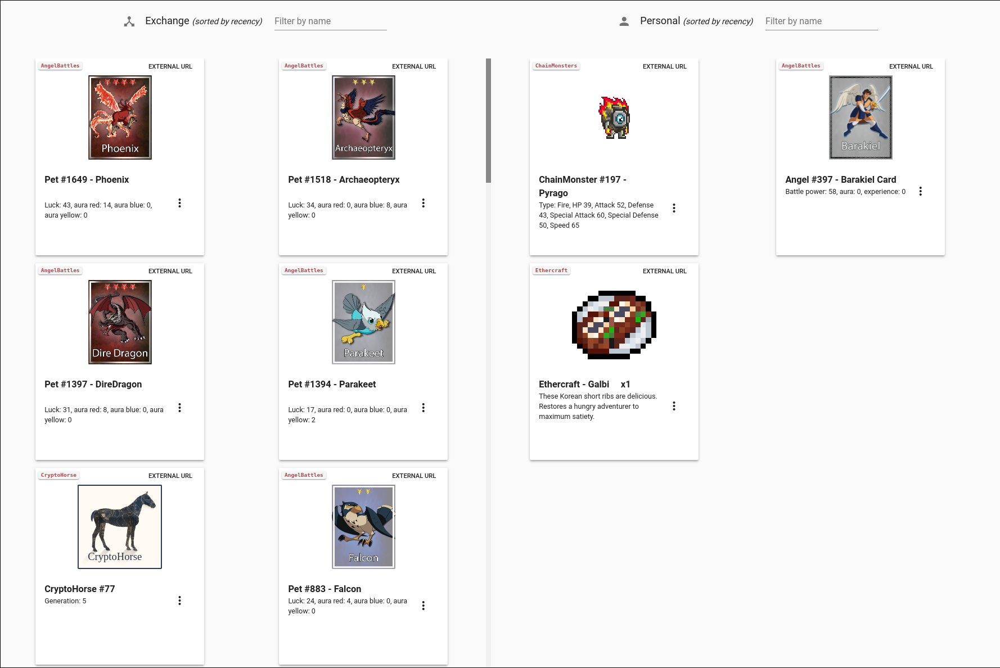
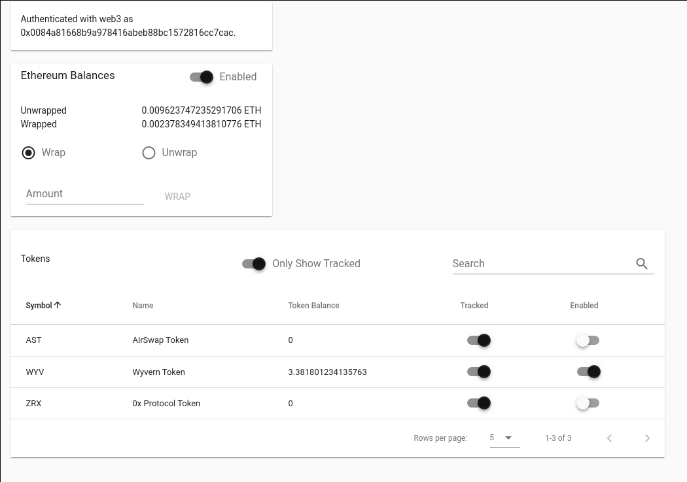

## Wyvern Exchange

**Example** concept, [already implemented](https://github.com/ProjectWyvern/exchange.projectwyvern.com).

New submissions should be more comprehensive in description — enough to facilitate implementation — and are encouraged to pursue better graphic design.

### Synopsis

The Wyvern Exchange will be a demonstrative testbed for the Wyvern Protocol, supporting any asset that can be bought or sold through Wyvern. The Exchange will provide a generic interface for browsing & posting orders, viewing assets by account, managing ERC20 tokens, and accessing order history.

### Mockups

#### Browsing Orders

Users can browse through the list of open orders, filtering & sorting by parameters of interest: asset type, method of sale, token, side, etc.

#### Posting Order

Users can construct an order in a step-by-step process, specifying all the necessary parameters.

#### Single Order

Users can view all details about a particular order.

#### Order Settlement

Users can follow the order settlement process in realtime, and debug any issues that may occur during settlement.

#### Asset Wallet

Users can browse through the assets they own, and easily sell a particular asset.

#### ERC20 Token Wallet

Users can browse through the tokens they own and enable/disable balance tracking in the UI.

#### Order History

Users can view their order history, including all past settlement information.

